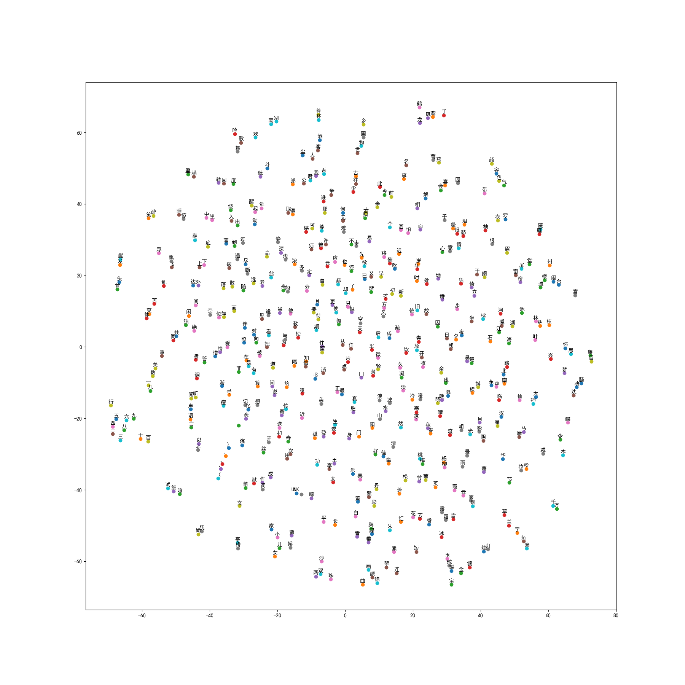

## 作业说明
- github地址：https://github.com/zhuyi55/week11
- 码云地址：https://gitee.com/itiszogo/bike-rent-count-predication/tree/master/AI_week11_proj
- 运行地址：https://www.tinymind.com/executions/l9gkzmag

### 作业中共包含了三个小作业
- hw_1 文件夹：rnn参数计算及反向传播的numpy实现
- word_2_vec文件夹：基于word_2_vec模型，全宋词的embedding
- rnn模型的代码实现

### rnn BPTT代码的实现
- 该小作业主要对前向和反向的计算过程进行了计算。
- 实现了前向传播中隐层hs[t]，输出层y[t]的计算。
- 实现了反向传播中dV,dW,dU,dbs,dbo的计算。
- 比较奇怪的是，输出结果与给的正确答案略有不同。为此我仔细查看了代码，检查了每次反向传播结束后的dV dW dU值。发现第一次迭代的计算结果与ppt上的一致，但还没有发现问题出在什么地方。

### 全宋词embedding
- 这部分功能修改了代码后，在本地运行并生成了tsne.png,embedding.npy,dictionary.json等文件。
- 代码修改过程中基本没有遇到什么问题，修改了词汇量大小，文件读取及初始化函数
- 对于matplotlib输出乱码的问题，对plt增加了中文字体的初始化以解决。
- num_steps增加到了40w，但在实际运行的过程中，到了10w步左右，loss下降的也开始变得不太明显。个人认为40W步训练略多了一点。
- 在最终输出的tsne.jpg图上，我们可以清晰的看到数字二~九聚集在了（-60,-20）附近。东西南北聚集在了(40,-20)附近。说明生成的数据有一定的意思。图如下：


#### rnn模型的实现
- model.py
  - 该模块构建了RNN训练模型
  - 通过BasicLSTMCell, DropoutWrapper, MultiRNNCell 三个cell构建函数的调用，构建了一个有3个隐层，维度为128的rnn模型。
  - 最后通过dynamic_rnn 来生成了一个动态rnn模型
  - 在函数激活过程中，定义并初始化了W_o和b_o的矩阵，

- utils.py
  - 该模块主要实现了get_train_data函数的功能
  - get_train_data每次由train.py在训练过程中来调用，获取拆分好可供训练的x和y。
  - 函数的输入vocabulary和输出(x,y)都为utf-8的中文字符。y为x顺移1个字符后的同长字符数组。依次分割后顺序输出用于训练。

- train.py
  - 该模块中主要修改了调用get_train_data函数后，对dl的处理，并生成feed_dict供模型训练。
  - get_train_data由于输出的都是字符，需要通过 utils.index_data 转成对应的int数组供模型训练。

- sample.py
  - 该模块原来并不需要修改，也可以正常运行。
  - 为了尝试使输出的内容更多元化，对每次预测的结果做了一个随机的处理。word_index=pred[0].argsort()[int(np.random.rand()*2)-2]

- 模型训练
  - 本文开头提交的运行地址中，对该模型运行了30个epoch，大约花费了15小时左右。
  - 摘录一些生成结果如下：
   ````
   江神子天
   说渔楼诘，一熟一搴山。瑕禄昽明千仞处，一片西风。

   水调歌头（寿）

   一笑一番，一笑毋、一笑且酬。一笑不须说，一笑一杯。看取

   蝶恋花


   满满。子以得之

   谒花岁（和仕堂韵）

   一叶江南，一番秋色，一番春色。一片春风，一片春风，不知春色。
   ````
  - 基本可以看到一些有意义的词汇和断句。但明显特别偏爱四字句式和喜欢用‘一’。
  - 为了可以输出更元化一些的字，我对每次预测在概率最高的两个字之间做了随机选择，并在原有训练好的模型上进行了预测：
````
江神子山
0山候用泰日（汜寿，惋产。疆天阙之之，因之以之之。>下其以赋，因以为此之之。因用而以为此。遂而有其以赋之矣；其语。以有人，以
2018-10-17 14:11:52,727 - DEBUG - sample.py:83 - ==============[蝶恋花]==============
2018-10-17 14:11:52,727 - DEBUG - sample.py:84 - 蝶恋花2劝人）醉后来、花景。风雨初晴不尽，一点春色无情绪，一点一春，一番一笑春风，不堪恨。人心有、无人情事，有谁同语春风，不用不堪愁酒
2018-10-17 14:11:52,932 - DEBUG - sample.py:83 - ==============[渔家傲]==============
2018-10-17 14:11:52,933 - DEBUG - sample.py:84 - 渔家傲夜海（芡德，一甫以赋此日作，作其语，作）今朝日上，不用一时人老，此地有谁知、不见有何妨也知|，为君归。不见不来一番，不如今夕之
（只跑了sample.py的运行模型在：https://www.tinymind.com/executions/9x8ams9g）
````
  - 无意义的多个换行符基本消失了，句子时长时短，虽然没有那么整齐，但也算符合宋词的特征。


